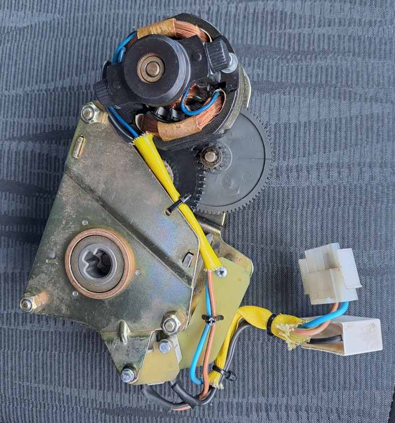
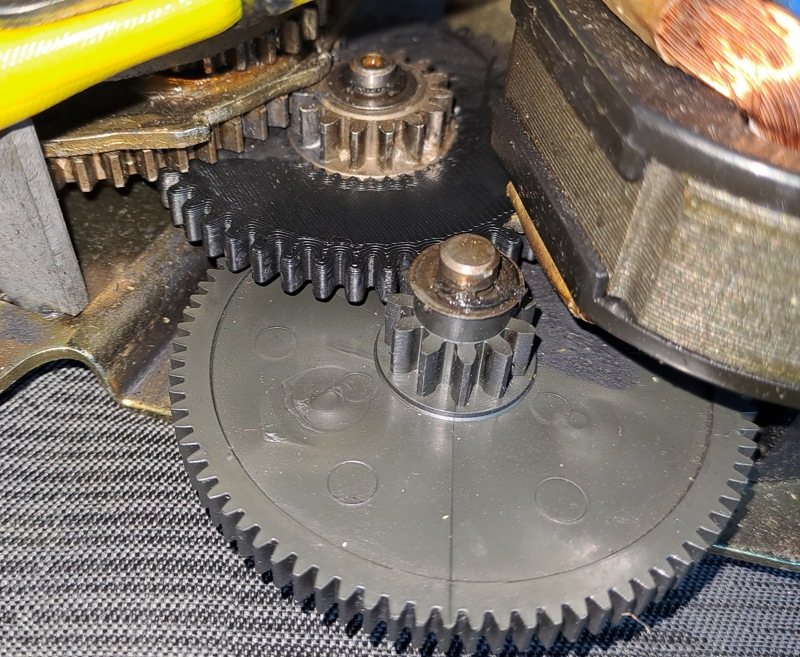
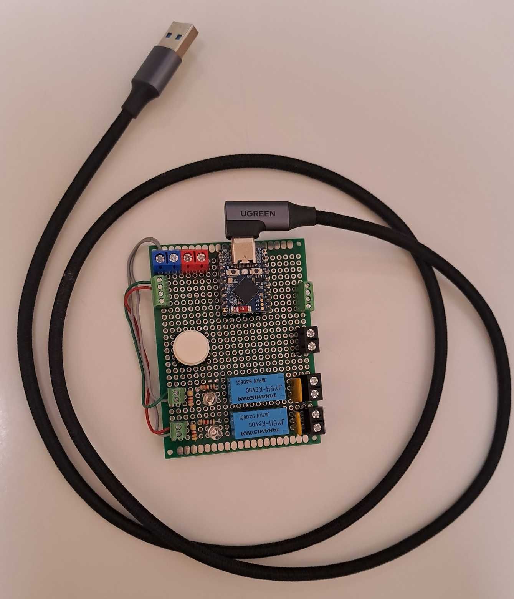
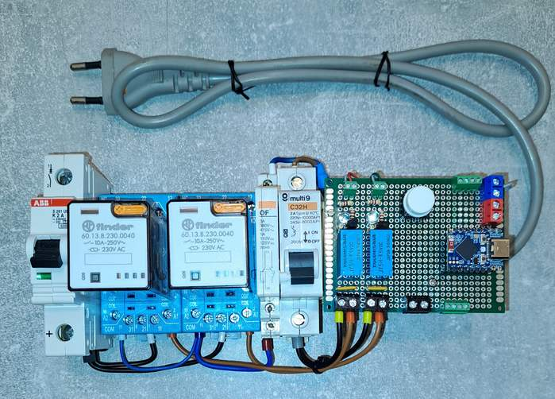

# circuit-breaker-on-off
CircuitPython test code for a spring charging motor of the high-voltage circuit breaker

Sorry folks, this repo comes with Hungarian comments only 🙂

# --- KÖF megszakító – felhúzómotor tesztelése ---

Egy műanyag fogaskerék cseréje után folyamatos KI-BE kapcsolásokkal nyúzzuk a rugóerőtároló egység felhúzó motorját.

A cél annak kiderítése, hogy a legyártott fogaskerék anyagválasztása sikeres volt-e.

Hardver: ESP32-S3 mikrovezérló

Szoftver: CircuitPython 9.x

A CircuitPython jelenleg a legdinamikusabban fejlődő programozási nyelv a DIY kategóriában (2025. okt.)

Ebben a repóban a tesztelő szoftver életútjáról találsz verziókövető leírásokat.
Ha ötleted van, vagy hibát találsz, bátran jelezd!

---
Egy kis vizuális betekintés

