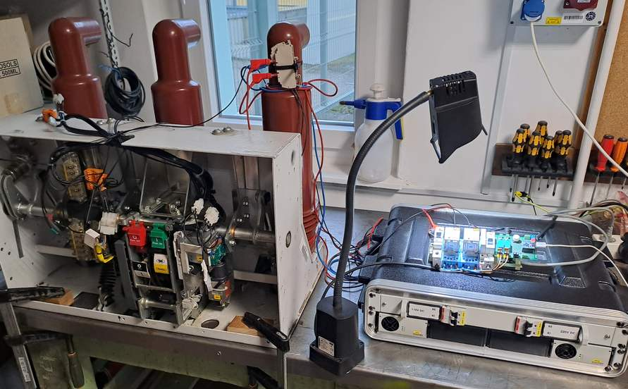

# circuit-breaker-on-off
CircuitPython test code for a spring charging motor of the high-voltage circuit breaker

**Disclaimer:**  
This is an independent, non-manufacturer document.  
See [SAFETY_AND_LEGAL.md](SAFETY_AND_LEGAL.md) for full legal and safety information.

Sorry folks, this repo comes with Hungarian comments only 🙂

# --- KÖF megszakító – felhúzómotor tesztelése ---

**Jogi figyelmeztetés:**  
Ez egy független, nem gyártói anyag.  
A teljes jogi és biztonsági információkat [itt olvashatod](SAFETY_AND_LEGAL.md).

**Az alapprobléma:**  
A rugófelhúzó egységben, idővel elreped az egyik fröccsöntött fogaskerék.

**Egy lehetséges megoldás:**  
3D nyomtatott műanyag fogaskerékre cseréljük a hibás alkatrészt.

**Tesztelés:**  
Folyamatos KI-BE kapcsolásokkal nyúzzuk a rugóerőtároló egység felhúzó motorját.

# A cél annak kiderítése, hogy a 3D nyomtatott fogaskerék anyagválasztása sikeres volt-e.

Hardver: ESP32-S3-Zero mikrovezérló

Szoftver: CircuitPython 10.x

A CircuitPython jelenleg a legdinamikusabban fejlődő programozási nyelv a DIY kategóriában (2025. okt.)

Ebben a repóban a tesztelő szoftver életútjáról is találsz verziókövető leírásokat.
Ha ötleted van, vagy hibát találsz, bátran jelezd!

---
Egy kis vizuális betekintés

